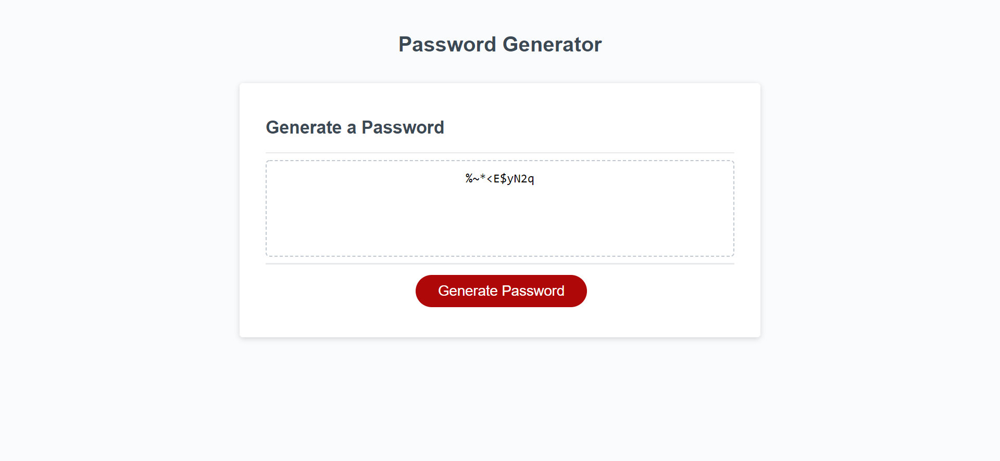

# Module 3 challenge Webpage

## Description

This Module 3 Challenge was created to complete the Module 3 Challenge of the bootcamp.

The Javascript file (script.js) of the original website has been updated to implement functionality to the "generate password" button
on the webpage. User can now set their criteria/requirements for the generated password by following the prompts after clicking the
"generate password" button, the generated password will be displayed in the text box once the prompts have been completed.

## Installation

N/A

## Usage

Link to the deployed website: https://wongpakho814.github.io/module-3-challenge/

## Credits

N/A

## License

N/A
